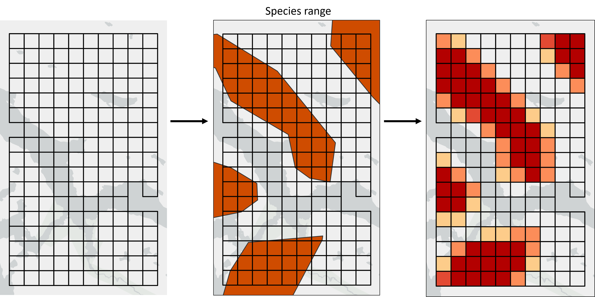
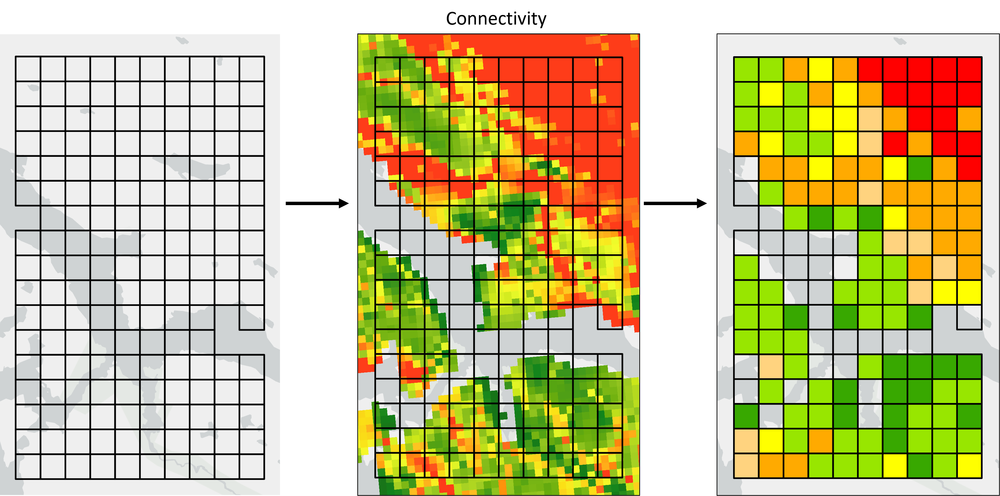
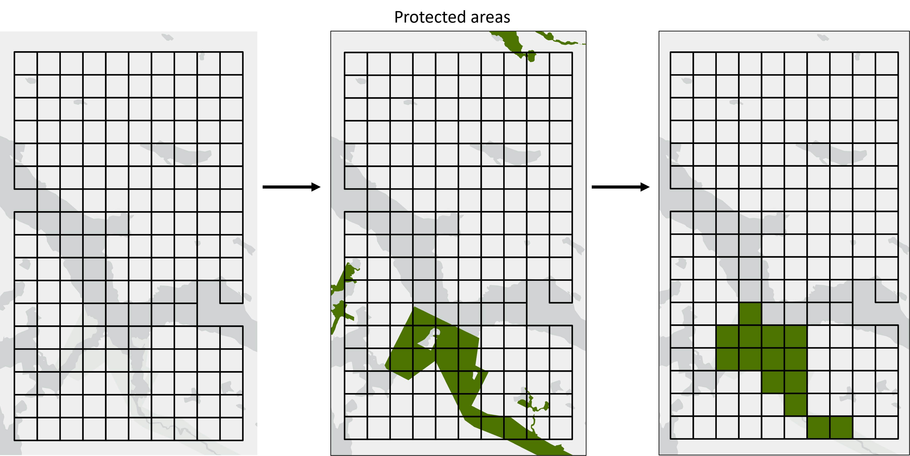

# Introduction

This article is intended for users already familiar with the basic functionality
of the Where to Work tool. It is recommended to first read the [official manual](https://ncc-cnc.github.io/wheretowork/articles/articles/wtw_manual.html)
before proceeding.

Input data for Where to Work needs to be summarized by planning unit during the 
data-prep stage. We strongly recommend using the 4-file input format described in
[wtw-data-prep](https://github.com/NCC-CNC/wtw-data-prep) with raster planning units,
or shapefile planning units if planning units of different shapes and sizes are 
required.

As described in the Goals section of the [wtw-theory](https://ncc-cnc.github.io/wheretowork/articles/articles/wtw_theory.html#goals) article, Where to Work
operates on the values assigned to each planning unit. Planning unit
values for Themes, Weights, Includes and Excludes therefore need to be carefully
prepared before feeding the planning units into Where to Work. 

The correct way to summarize the input data depends on the
planning unit type (i.e. equal area vs different areas), the units of the input data 
(i.e. area/distance/count, other units, unitless), and the type of layer being 
summarized (i.e. Theme, Weight or Include/Exclude).

Planning unit values can generally be of two types: binary, where all the values
are either zero or one; or continuous, where any value is possible. Generally we 
recommend that all Includes and Excludes use binary values, and all Themes and 
Weights use continuous values. This is explained further below.

# Themes

The important thing to remember for Themes is that each Theme will be assigned a
Goal, and Where to Work will attempt to meet the Goal by summing the Themes values
across all planning units in a solution. Values therefore need to be numeric, have 
specific units (e.g. km, km2, tonnes of carbon ect.), and ideally we would like to 
retain as much detail from the source data as possible when we summarize the data 
into the planning units.

#### Area/distance/count

Most Themes will be layers representing area, distance or count data. Examples 
are species ranges (area), lengths of rivers (distance), and points representing
important sites (count). We recommend simply summing the area/distance/count of
these data in each planning unit.

```{r echo = FALSE, fig.cap = "*Fig 1. Species ranges representing areas of presence/absence are converted into plannnig unit values representing the area of each planning unit covered by the species range.*"}

```


In the case of species range data, we could set a threshold (e.g. 50%) and assign 
each planning unit to presence/absence based on the overlap with the 
planning unit and the threshold (i.e. every planning unit would have a value of either
zero, or the full planning unit area). This approach creates clean maps that look
nicer in the Where to Work display. However, summing the area retains more information,
especially in cases where some range polygons are smaller than the planning units.

#### Other units

Other layers could have non-area/distance/count units that will need to be considered
on a layer-by-layer basis. A dataset detailing tonnes of Carbon per pixel for example
could be summed to calculate the tonnes of Carbon per planning unit. Remember that 
Where to Work will run using any input layer values, so the responsibility
is on the user to make sure the values provided are suitable.
```{r echo = FALSE, fig.cap = "*Fig 2. A raster layer representing tonnes of Carbon can be summed into the planning units and can retain the same units.*"}
knitr::include_graphics("figures/carbon.png")
```


#### Unitless/non-numeric values

If users want to inlcude Themes from input data that do not have units, or are 
categorical, it is usually best to convert the source data into polygons and use
the area approach described above. Here are some common examples:

1. **Categorical land cover data** - extract each land cover type as a separate 
Theme and calculate it's area in each planning unit.

2. **Species probability maps** - these are not recommended because they are unitless.
Additionally, while Where to Work would run using probability values, it can result
in solutions that meet the Goal by collecting lots of planning units with low
probability values which is this case represents low quality habitat. This is not
really what we want, it would be better to meet the target with higher quality 
habitat only. The best approach is to choose a threshold and convert the habitat 
probability into a binary map of high quality habitat. This can then be treated 
as an area layer and the planning unit values will represent the area of high 
quality habitat.


# Weights

Ideally, data-prep for Weights should follow the same guidelines as Themes,
however since Weights do not have Goals attached to them there is some additional
flexibility. Unitless Weights can be used for example, as long as the values
are numeric.

If planning units are all the same size, it may be appropriate to calculate the mean
Weight value per planning unit. However, where possible we still recommend summing
values, especially if planning units are of different sizes. This is because Where
to Work does not account for planning unit area when processing Weights. If a
larger planning unit should have a relatively higher Weight than a smaller one,
this should be accounted for during data prep (e.g. by summing rather than averaging).

```{r echo = FALSE, fig.cap = "*Fig 3. Connectivity is a unitless Weight. Here we calculate the average connectivity value per planning unit, but if planning units were of different sizes we might consider summing.*"}

```


# Includes/Excludes

The guidelines for Includes and Excludes are different because every planning unit
needs to be either locked-in or locked-out of the solution. Values should therefore
be binary where each planning unit has a value of zero or one. This means that for
source data representing areas, users will need to decide thresholds to determine 
if planning units are assigned as zero or one depending on the overlap of the 
planning unit with the source layer. Using a 50% threshold for areas is generally
recommended because it should average out to cover approximately the same area as 
the input data. In some cases users might want to use a different approach. For 
example an Include could be set to one if any of the planning unit intersects with 
the source layer.

```{r echo = FALSE, fig.cap = "*For n includes of existing protected areas, we use an area threshold of 50% so any planning unit with >= 50% coverage is assigned a 1, otherwise it's assigned a 0.*"}

```

# Data prep

More information on data prep as well as scripts for preparing input data of various
formats can be found in [the wtw-data-prep](https://github.com/NCC-CNC/wtw-data-prep) 
github repo.