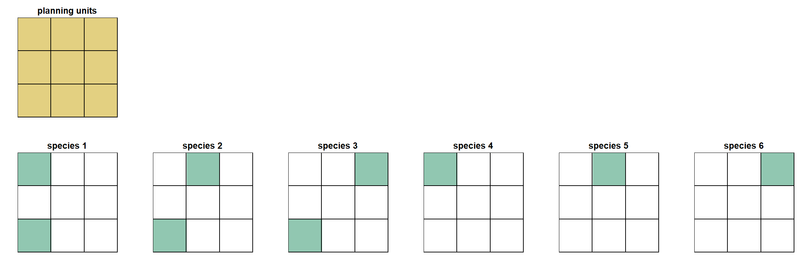
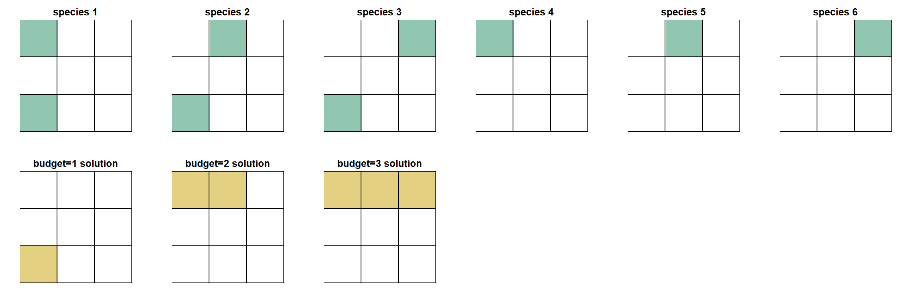

# Introduction

This article is intended for users already familiar with the basic functionality
of the Where to Work tool. It is recommended to first read the [official manual](manual.html)
before proceeding.

The goal of this article is to explore some of the underlying algorithms and
behavior of Where to Work, so that users can better understand and interpret
their results. This will also allow users to develop more advanced workflows
to fully utilize the power of the tool for systematic conservation planning.

For the purpose of this article, we will briefly review the main components of
Where to Work:

- **Planning units**: the building blocks for Where to Work, each planning unit
has a value for all the conservation Features (e.g. species) and Weights (e.g. 
human footprint) loaded into the app. 
- **Goals**: the amount of each conservation Theme or Feature that needs to be captured in
the solution (e.g. 20% of a species range).
- **Includes**: any planning units that should be locked-in to the solution.
- **Excludes**: any planning units that should be locked-out of the solution.
- **Area budget**: an optional cap on the number of planning units that can be used
in a solution.
- **Weights**: secondary objectives whereby if two solutions meet the same Goals,
the solution satisfying the Weights should be preferred.

We can think of the combination of planning units, Goals, Weights, Includes,
Excludes and area budget as defining a specific Where to Work scenario which we
will refer to as a `conservation problem`. The goal of Where to Work is to
solve the `conservation problem` by finding the optimal combination of 
planning units that meet all the Goals while accounting for any Weights, Includes
and Excludes. If an area budget is defined, then Where to Work attempts to find
the best solution to the `conservation problem` using the number of planning units
it has available based on the area budget.

The underlying software running the Where to Work algorithms is an R package
named [**prioritizr**](https://prioritizr.net/index.html). prioritizr is a powerful
coding tool for finding the optimal solution for complex `conservation problems`.
Where to Work can be thought of as one implementation of prioritizr, it provides
some of the most common prioritizr functionality in a user accessible online
application, but there are many more advanced features in prioritizr that are
not available in Where to Work.

We will provide links to the [prioritizr documentation](https://prioritizr.net/) 
at various points in this article for readers interested in learning more.

# Planning Units

Planning units for Where to Work can either be square cells of equal size (i.e.
a raster layer), or a combination of polygons of any shape and size (i.e. a shapefile). 
The data preparation for Where to Work involves summarizing all of the Themes,
Weights, Includes and Excludes in each planning unit. More information on this can
be found in the [data article](data.html) and in the 
[wtw-data-prep](https://github.com/NCC-CNC/wtw-data-prep) github repo.

# Theme Goals

Setting Theme Goals is the first step in a Where to Work project. Goals are set as % 
values that get translated into a numeric Goal within Where to Work. Where to 
Work will try and meet the Goal by ensuring that the planning unit values in the
solution exceed the numeric Goal. The numeric Goal for a Feature is the calculated as:

`numeric Goal = sum of all values in all planning units * (1 / Goal %)`

Typically, Themes represent the spatial extent of a conservation feature (e.g. a 
species), so the numeric Goal will be an area. Where to Work doesn't actually care
what the units are though, it simply calculates the numeric Goal based on the values
in the planning units.

This is important to know when preparing data and setting Goals. The planning unit
values need to be numeric so that they can be summed together across planning units. It doesn't make
sense to have categorical or ordinal data in Where to Work for example because the values 
cannot be summed for Goal-setting. A land cover map representing forested and grassland
areas for example would need to be separated out into two individual Themes where
the planning unit values represent the area of each land cover type within the planning
unit. See the [data article](https://ncc-cnc.github.io/wheretowork/data.html) 
for more examples of this.

# Includes/Excludes

Includes and Excludes are simple to understand, they force-in or block-out planning
units from the final solution. They can be a powerful way of customizing
your `conservation problem`. See the [Advanced workflow](#advancedworkflows)
section for examples and the [data article](https://ncc-cnc.github.io/wheretowork/data.html) 
for data prep tips.

# Area-budget

An area budget can be applied in Where to Work which will restrict the number of planning units
available in a solution. This is common in target based conservation planning where
we often want find the optimal area to protect if we can only conserve say 30% of
the landscape. We recommend always solving the `conservation problem` first using 
no area budget. This will give a baseline solution which can then be restricted 
by applying an area budget (see the [Recommended workflow](#workflow) below).

An important point is that `conservation problems` with and without an area-budget
use different underlying algorithms to generate a solution. 
**If no are budget is used, the solution will meet all Goals using the smallest**
**area of planning units possible.** Once an area budget is applied that is less
than that required to meet all targets, Where to Work needs to decide how best to
meet the Goals it can using the planning units it has available, recognizing 
that some Goals will not be met. These different objectives are discussed more below.

For the purpose of demonstrating these concepts, we will set up a simple example
using some demo data.

We'll have 6 species, each occupying either one or two of our nine planning units. 
For simplicity, the Goal for each species will be 1 planning unit.

```{r echo = FALSE}

```

### No area-budget

If no area budget is set, then Where to Work runs an algorithm that aims to
meet all of the Goals using as little planning unit area as possible. In our
example, since our planning units all have the same area, it will simply meet the
Goals using the fewest number of planning units.

In the prioritizr world, this algorithm is known as the 
[min set objective](https://prioritizr.net/reference/add_min_set_objective.html).
It uses a mathematical algorithm to identify the 'minimum set' of planning units
that meet all the Goals.

In our example, the minimum set solution is the top row of planning units. This
is the only way to represent at least one planning unit of each species using
just three planning units.

The larger the Goals, and the more you have, the more planning units will be
needed to find the minimum set solution. This is worth thinking about when setting
your Goals. If you have a species that covers all your planning units, and you set
a Goal of 50%, your solution will automatically need to cover at least 50% of the
planning units.

```{r echo = FALSE}
knitr::include_graphics("figures/theory2.png")
```

### With area-budget

If an area budget is set in Where to Work, it limits the number of planning
units available in the solution. Since Where to Work will not be able to
meet all of the Goals, it has to decide how to allocate the planning units to get
the 'best' solution. There are [different ways to do this](https://prioritizr.net/reference/objectives.html), 
Where to Work uses a method that minimises the total Goal shortfall (the
prioritizr algorithm for this is called the [min shortfall objective](https://prioritizr.net/reference/add_min_shortfall_objective.html)).

Shortfall is the proportion of each Goal that has not been met. Note that
using the proportion rather that the actual area standardizes shortfall across
all Goals, so it doesn't matter how big the original area Goal was, only the
proportion missing counts. If a Goal is met then its shortfall is zero. If a
Goal has no representation in the solution, then it's shortfall is 1. 

The algorithm sums all of the shortfalls while searching for a solution, and the
optimal solution will be the one that has the lowest total shortfall value. In
practice, this algorithm does a good job of passing Goals while maintaining 
a balanced amount of the missing Goals. In general, the missed
Goals tend to be fairly evenly distributed throughout the planning units of the
final solution (i.e. the shortfalls of missed Goals follow a normal distribution).

In our example, if we assign Where to Work a budget of two planning units, the
best solution that minimises overall shortfall is to select two planning units
from the top row. The best we can do with two planning units is to fully meet
three Goals, and fully miss two goals.

```{r echo = FALSE}

```

The calculation of total shortfall for this solution is as follows:

```
total shortfall = 
            species 1 shortfall + 
            species 2 shortfall + 
            species 3 shortfall + 
            species 4 shortfall + 
            species 5 shortfall + 
            species 6 shortfall
```
where the shortfall for a give species is calculated as:
```
target missing / target
```
For our solution, species 3 and 6 are the only ones not met, so total shortfall 
is calculated as:
```
(0/1) + (0/1) + (1/1) + (0/1) + (0/1) + (1/1) = 2
```

### Area-budget - recommended workflow {#workflow}

Solutions using area budgets can show strange patterns as the area
budget approaches and exceeds the minimum set area. The reason
for this is that the if the algorithm meets all the targets but still has some
area budget left, it doesn't know what to do with it. It will start to sequentially 
gather additional planning units to use up the area budget, leading to strange
patterns in the solutions. This is described in more detail 
[here](https://github.com/prioritizr/prioritizr/issues/205).

**For this reason, it is important that the area budget never exceeds the amount**
**needed to meet all Goals.**

We therefore recommend the following workflow when using area budgets:

1. Develop the `conservation problem` by setting Goals and deciding on any Weights,
Includes and Excludes.
2. Run the minimum set (no area budget) solution to find out how many planning units are needed 
to meet all Goals. Where to Work will report the total number and % of planning
units in the solution.
3. Run the area budget solution(s), but do not exceed the values reported in the
minimum set solution. For example, if the minimum set solution uses 50% of the planning 
units, do not exceed 50% as an area-budget. Our testing suggests that keeping area budget 5-10% below
the min set % is good practice.
4. If the min set solution uses fewer planning units that the area budget you are
interested in, increase your Goals. For example, if you want to test a 30% area
budget for 30x30 planning, but your min set solution only requires 25% of the
planning units to meet all targets, then you need to make you `conservation problem`
more difficult by increasing the Goals.


### Area-budget nestedness {#nestedness}

While thinking about area budgets it's worth discussing nestedness. There is a 
general expectation that when using increasingly large area budgets (e.g. 10%,
20%, 30% etc.) that solutions from lower area budgets will be nested inside the
solutions of larger area budgets. For example, we might expect the 10% solution
to be contained within the 20% solution and so on. 

The thinking here is that the 10% solution must be capturing the best, most
important planning units on the landscape, and so we'd expect those to also be
included in the higher area budget solutions. 

This is not always the case, for the important reason that the prioritizr 
algorithm does not rank planning units based
on how important they are, rather for a given `conservation problem` it returns
the optimal solution based on that problems parameters. When the area budget
changes, so does the `conservation problem`, and since the objective is to find
the most efficient solution that satisfies the `conservation problem`, there is
no guarantee that solutions will be nested.

This is actually an intended feature of prioritizr and it means that Where to Work 
allows us to solve much more complex and tailored scenarios.
Instead of ranking all planning units based on a simple metric
such as species richness, and then selecting the top 10%, 20%, 30% etc. (which
would be nested), we are able to set individual Goals for hundreds of Features
and find the optimal combination of planning units to meet those Goals. All the
planning units in the solution contribute to meeting the Goals, and if we want
to know which planning units contribute to the most Goals, we can do
subsequent analyses to investigate this (e.g. [prioritizr importance scores](https://prioritizr.net/reference/importance.html);
[Resiliency Index tool](https://github.com/NCC-CNC/impact)).

We can demonstrate this non-nested behavior with our example data. When we calculate the optimal
solution using area budgets of one, two and three planning units, we see that
the first solution is not nested within the others. The reason for this is that
with an area budget of one, we're trying to meet as many Goals as possible with a
very limited budget. This is a challenge and the best we can do is to meet three
Goals using the bottom left planning unit. As we increase the area budget, we
have more planning units to play with. We can actually find better solutions by
ignoring the bottom left planning unit and focusing on other planning units where 
those species also occur (and overlap with other species).

```{r echo = FALSE}

```

This is obviously a very simple example and in real world problems we often have
many thousands of planning units and large numbers of Goals. In our testing, we
have found that the non-nested behavior described here is most apparent at low
area budgets (e.g. 10% when the min set requires 50%). As area budgets increase,
the solutions should become more nested and will converge towards the minimum set
solution.

It's also worth noting that some `conservation problems` do produce nested solutions
in Where to Work.It really depends on the distributions of the Features and the Goals of a given
problem.

# Weights

**Update this section after completing [#329](https://github.com/NCC-CNC/wheretowork/issues/329)**

Using Weights in Where to Work can be difficult because there is no way to know 
exactly how a Weight will impact your solution. All we know is that given
multiple competing solutions, the one that best satisfies the Weight requirements will
tend to be selected. 

It's possible however that a selected Weight is incompatible with the primary
objective of meeting Goals. This can be confusing when you select the Weight
but it has no impact on the solution. To return to our simple example, we might
add a positive Weight to our `conservation problem` that aims to weight solutions 
towards areas known to have high connectivity. If the area of high connectivity
does not overlap with any of our species, the Weight will have no impact on the 
selected solution. Since the Weight is a secondary objective, it can only 
influence the solution if it overlaps with some planning units that satisfy the Goals.

```{r echo = FALSE}

```

Given the different algorithms used for area-budget vs. no area-budget problems
in Where to Work, Weights have to be applied differently in the underlying code.
The outcome is the same: solutions satisfying the Weights will be preferred. To
fully understand what Where to Work is doing we will review the two approaches
below (this gets more technical so feel free to skip this section!).

### Weight with no area budget

In Where to Work, the 'budget' being used when gathering planning units into a 
solution is the planning unit area (**under min set it currently defaults to 1 but we should change to area**). 
For the minimum set problem we are trying to 
meet the Goals while minimizing area. In the prioritizr world, this is referred 
to as the 'cost' of the planning unit. And in prioritizr, cost does not have to
be area, it can be the literal cost to acquire a planning unit, or any other value
assigned to planning units that governs how costly they are to add to a solution.

When applying Weights under the minimum set problem in Where to Work, we take
advantage of this to change the cost of planning units based on the selected
Weights. If no Weights are selected, the planning unit cost is simply the area of the planning 
unit (**currently defaults to 1**). If Weights are selected, the Weight layers 
are multiplied by the selected Weight factor (ranges from -100 to 100), rescaled,
and summed together (when using multiple Weights). (**see #329, need to explain that Weights should acount for PU area in data prep**)
The result is that planning units with higher values of positive Weights are assigned
lower costs and will be preferred in solutions, and planning units with higher 
values for negative Weights are assigned higher costs and will be avoided.

### Weight with area-budget

When using an area budget, the planning unit 'cost' has to be the actual
area of each planning unit. That way Where to Work knows how much area budget it is using
based on the planning units selected. This means we cannot incorporate the Weights
into the planning unit costs as we did for the minimum set problem.

Instead, the Weights are added as additional Goals to the `conservation problem.`
The Goal is calculated as the Weight factor (converted to a proportion) multiplied
by the sum of the Weights values across all planning units. When finding a solution,
Where to Work will try and meet the Weight Goals just like any other Goal, so the
final solution should prefer planning units that contain a larger amount of the
Weight (**note that weights are not currently clipped to Themes, see #323**).

Note that under both area-budget and non-area-budget scenarios, Where to Work will
report the area of each Weight in the results summary.


# Optimality gap

When solving `conservation problems`, prioritizr has a parameter called the 
**optimality gap** which determines how close the returned solution needs to be
to the optimal solution. If the optimality gap is set to 0%, the single best
optimal solution will be returned. This comes with a time penalty since solving
to optimality takes a certain amount of time depending on the complexity of the 
problem.

Where to Work sets the optimality gap to 10% for the minimum set problem and 50%
when using an area budget. This allows for much faster processing and means that 
the returned solutions will be within 10% or 50% deviance of the optimal solution.
The downside is that two Where to Work runs using the same inputs could return
different solutions.

If a user runs the exact same `conservation problem` twice in the same Where to
Work session, it will cache the solution and simply return the same solution to 
save time on the second run. If a user runs the exact same `conservation problem` 
twice in different Where to Work sessions (i.e. by closing the app in between), it's
possible that slightly different solutions will be returned due to optimality gap.
The deviance between solutions is usually quite small, and is mostly noticeable
when the problem is relatively simple and has many equally good solutions that meet
the Goals (maybe because there are a small number of Goals, or Goals are easy to
meet). As problems get more complex by adding more Goals, higher Goals, and adding
Includes and Excludes, the effect of the optimality gap decreases and in most cases
that we have tested, the same solution is returned across different sessions.


# Advanced workflows {#advancedworkflows}

### Getting creative with Includes

Includes allow the user to force a set of planning units into the solution. This is
typically used for including existing protected areas in the solution since they
are already providing protection and therefore represent a logical starting point
for building out a prioritization.

Includes can however represent any important feature that a user wants to lock in
to a solution. This could be certain planning units that represent critical habitat
that should be the starting point of a solution (note that in the case of Features, 
using an Include is the same as setting a Goal to 100%), or they could represent
areas that have important cultural values that are central to the planning objective
and not merely Goals. 

### Forcing nestedness

Users can take Includes a step further by linking multiple solutions together, i.e.
taking the output of one *conservation problem* and using it as an Include for the
next. [This paper](https://doi.org/10.1038/s41559-021-01528-7) provides an example
of this to force solutions at different area budgets to be nested within each other.
The approach involves running an area-budget solution at say 10%, then providing that
solution as an Includes in a 20% area-budget solution and so on. This forces the 10%
solution to be the starting point for the 20% problem and ensures all lower area-budget
solutions are nested within higher area-budget solutions. 

We do not necessarily recommend this for a typical prioritization (due to the reasons 
highlighted in the [nestedness](#nestedness) section above), but we include it here 
as an example of how Where to Work is flexible to user needs and creativity.

# Further reading

More information on the mechanics of Where to Work can be found in the following
resources:

- A good place to practice and get familiar with some of these advanced concepts
is by using some of the simple built-in projects in Where to Work.
- [prioritizr website](https://prioritizr.net/index.html) - this has much more detail
on the underlying math behind the algorithms. The [publication record](https://prioritizr.net/articles/publication_record.html)
also has many examples of these concepts being applied in conservation scenarios.
- [source code](https://github.com/NCC-CNC/wheretowork) - the Where to Work source 
is publicly available on github.