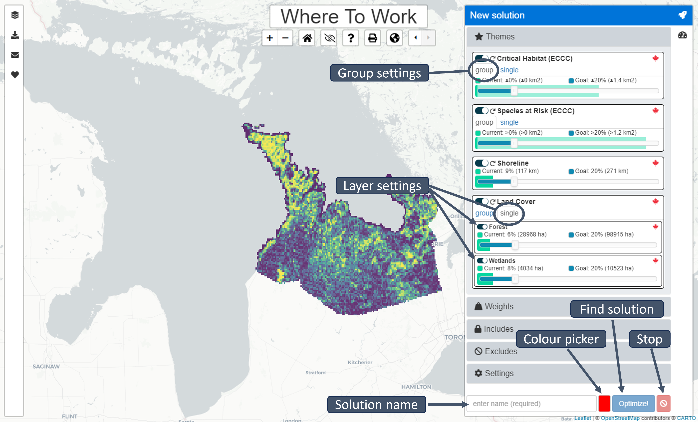
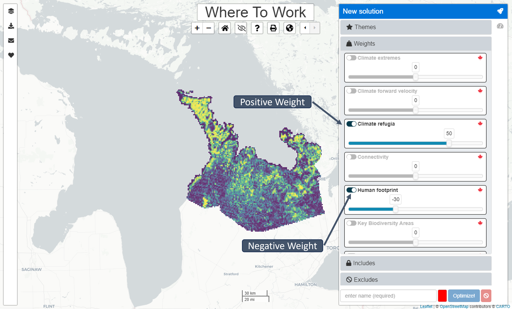

# About

## Intended audience

This manual was written for NCC-CNC GIS staff to provide explanations for the basic functionalities of the *Where to Work* tool (advanced version), to allow testing and recommendations for improvement during the development phase. As such, it is subject to change.

## Purpose of tool

NCC is adopting a systematic and standardized approach to land prioritization via the introduction of a spatial prioritization tool *Where to Work* to NCC's conservation planning framework. Doing so enables NCC to establish quantitative, organization-wide conservation goals and positions NCC to report on its collective impact in a way that resonates with donors, partners and funders.

*Where to Work* is a web-based, graphical user interface that uses an algorithm to build and solve complex conservation planning problems. The spatial prioritization tool that *Where to Work* interfaces, or interacts, with is prioritzr, which uses integer linear programming techniques to solve problems. The exact algorithms used are guaranteed to find the optimal result [@r3; @r2] and can analyze large, complex datasets efficiently, providing near real-time analysis for stakeholder meetings and discussions [@r3]. However, it is important to note that what is optimal mathematically may not be optimal from a practicality standpoint, and the results are dependent on the input data. Thus, the tool is intended for decision support, but is not meant to dictate final decisions.

## Software dependencies

The tool is available as an online web application. For the best experience, it is recommended to use the latest version of the Google Chrome web browser (https://www.google.com/chrome/). Efforts have been made to support other web browsers, such as Mozilla Firefox, Microsoft Edge, and Apple Safari.

## Code availability

All code for the *Where to Work* tool is publicly available on GitHub (https://github.com/NCC-CNC/wheretowork). If you find problems with the *Where to Work* tool you can submit an issue (also known as a ticket) on the online bug tracker (https://github.com/NCC-CNC/wheretowork/issues). If you are not familiar with GitHub, please feel free to get in touch via email (please context dan.wismer@natureconservancy.ca or marc.edwards@natureconservancy.ca).

# Terminology and concepts

## Systematic conservation planning

A commonly used decision-support framework that seeks to optimize where to act and what to do in a systematic and repeatable way – two key outputs of a conservation planning process.

## Spatial prioritization tool

A problem-solving tool that uses an algorithm to inform the spatial allocation of conservation actions (e.g., prioritzr, Marxan, Zonation).

## Planning unit

A spatial locality (or area) that can be managed independently from other localities. In many cases, planning units are defined using property boundaries. In other cases, especially in large-scale planning exercises, landscapes are often divided into equal-area (e.g., 1 km^2^) grid cells that are used to serve as different planning units.

## Theme

Themes describe facets of biodiversity that are important for conservation (e.g., species, habitats, ecosystems). To help safeguard Themes, you can set Goals to ensure a minimum level of coverage by solutions (e.g., setting a Goal of 20% ensures that 20% of the overall spatial extent of the Theme is covered by the solution). Some Themes can contain multiple components that are termed Features. For example, a Theme pertaining to Threatened Species may contain Features, wherein each Feature corresponds to a different species. Note that "goals" used by the Where to Work tool are conceptually identical to "targets" used by Marxan.

## Weight

A Weight describes properties of places that can impede or improve conservation
efforts. Set the Weight factor between -100 and 100 to indicate how important it is to avoid or cover (respectively) a given Weight in the solution. To completely avoid a Weight (e.g., to avoid areas with high human footprint), use a value of -100 (i.e. ensure that planning units with the lowest possible values in the Weight dataset are selected). To include as much of the Weight as possible (e.g., to include areas climate refugia), use a value of 100 (i.e. ensure that planning units with the highest possible values in the Weight dataset are selected). Setting a value of zero (deselecting the Weight using the toggle) means that it is not considered at all in the prioritization.

## Includes

This term refers to areas that are already managed for conservation; to build on the current reserve network, these areas should be automatically included. However, solutions can be constructed that do not automatically include the current reserves. These are also useful to explore counterfactuals and management plans generated using other processes (e.g., what if we built a new system from scratch?). Note that Includes play a similar role to "locked in" planning units when using Marxan.

## Excludes

This is the opposite of an Include. Areas defined as Excludes are removed from
the analysis and cannot be selected to contribute to Goals. Note that Excludes play a similar role to "locked out" planning units when using Marxan.

## Reserve

A spatially contiguous set of planning unit selected for prioritization.

## Algorithm

An optimization routine that aims maximize performance according to certain
criteria. Specifically, the *Where to Work* tool uses exact algorithms implemented with the [CBC]((https://github.com/coin-or/Cbc)) (Coin-or branch and cut) or [Gurobi](https://www.gurobi.com/) mixed integer programming solver.

# Launching *Where to Work*

## Accessing the tool

The tool can be accessed online (https://ncc.carleton.ca/).

## Select import method

To begin, select the method for importing data into the application. To use a
previously prepared publicly available project, select "built-in project."

To upload a project dataset that was previously prepared for you personally, select "upload project data." This is the recommended approach and is explained in detail in the [wtw-data-prep GitHub repository](https://github.com/NCC-CNC/wtw-data-prep).

To upload a spatial dataset that has not been prepared specifically for the tool, select "spatial dataset." We don't recommend this method for reasons explained in the [wtw-data-prep  GitHub repository](https://github.com/NCC-CNC/wtw-data-prep/tree/main/shapefile_example).

### Built-in project

Sample projects are pre-loaded into the app. Select the project you wish to view, then click "Import." Several of these projects are sample projects (e.g., those with the name "simulated") and others have been prepared by GIS technicians.

### Upload project data

A project dataset comprises four files. These files include configuration file, spatial data, attribute data, and boundary data files. These files are created using custom R scripts or the ArcGIS plugin currently under development. In most cases, a GIS technician would prepare these files specifically for your project. Please note that all four files need to be uploaded to the application.

Instructions and example scripts for creating these files can be found in the [wtw-data-prep GitHub repository](https://github.com/NCC-CNC/wtw-data-prep).

#### Select configuration file

A configuration file contains the specification for the project. It specifies the Themes, Includes, Excludes and Weights that are part of the project, along with default settings and colors for visualization. This file is encoded using YAML (e.g, `project.yml`) file format (https://yaml.org/).

#### Select spatial data

A spatial data file contains the geographic information used to display the data on a map. Spatial data files can either be in the GeoTIFF format (e.g., spatial_data.tif) or the ESRI Shapefile format. Note that the ESRI Shapefile format is a file format that spans multiple files with the same prefix and different file extensions. For example, when uploading an ESRI Shapefile called "spatial_data", you must upload all four of the following files: `spatial_data.shp`, `spatial_data.prj`, `spatial_data.shx`, and `spatial_data.dbf`.

#### Select attribute data

An attribute data file details the expected amount of each Theme, Weight, or Include within each planning unit. The attribute data files can be supplied in the Comma Separated Values format (e.g., "attribute_data.csv"), or a compressed version of this format (e.g., "attribute_data.csv.gz"). Here, each column pertains to a different Theme, Weight, Include or Exclude, and each row corresponds to a different planning unit. The last column in this file should be called "_index" and indicates the spatial index associated with each planning unit (e.g., the index of the grid cell or geometry each planning unit is associated with in the spatial data file).

#### Select boundary data

A boundary data file contains information on the spatial boundaries of the planning unit. The boundary data file can be supplied in the Comma Separated Values format (e.g., `boundary_data.csv`), or a compressed version of this format (e.g., `boundary_data.csv.gz`). Specifically, it can be provided using the Marxan boundary data file format, wherein it contains the following three columns: `id1`, `id2`, and `boundary`. The `id1` and `id2` columns indicate the shared boundary between different planning units based on their spatial indices, and the `boundary` column indicates the length of these shared boundaries (e.g., 100 m). To encode the length of boundaries along the outer edge of the study area, the `id1` and `id2` columns can contain the same spatial index value. This data is used when the spatial clustering options are enabled (see below).

### Spatial dataset

An ESRI Shapefile can be uploaded to the application to automatically create a new project. Please note that this approach is not generally recommended for beginner users, because users need to ensure that the spatial dataset contains all relevant Themes, Weights, Includes and Excludes. Additionally, because the spatial dataset upload option involves creating a new project, this means that none of the Themes, Weights, or Includes/Excludes will have sensible default options (e.g., Goals or factors) and the provenance of the underlying data is unknown. Note that the ESRI Shapefile format is a file format that spans multiple files with the same prefix and different file extensions. For example, when uploading an ESRI Shapefile called "spatial_data", you must upload all four of the following files: `spatial_data.shp`, `spatial_data.prj`, `spatial_data.shx`, and `spatial_data.dbf`.

# Sidebars

```{r echo = FALSE, fig.width = 12}
knitr::include_graphics("figures/sidebar1.png")
```

## Table of contents

Open and close the Table of contents by clicking the layers icon. Themes are identified with the star icon. Weights are identified with the Weight icon. Categorical data will automatically be assigned a colour category and continuous data will automatically be assigned a colour range.

To view/hide Themes, Features, and Weights click the eye icon. Visibility of a Feature or Weight does not impact prioritization solutions.

```{r echo = FALSE}
knitr::include_graphics("figures/sidebar2.png")
```

## New solution

Open and close the New solution sidebar by clicking the rocket icon. To generate a new solution, select the Themes, Features, Weights, and attributes for inclusion to include in the solution with the toggle button to the left of each parameter. Enter a name for the solution in the bottom bar and select the display colour for your new solution with the colour picker. Click the "Optimize!" button to generate the new solution. Once a new solution is generated, it will appear in the Table of contents sidebar.

```{r echo = FALSE}

```

### Themes

Themes can be selected (enabled) so that they are used to generate solutions (i.e., by clicking the toggle button next to each Theme). If a Theme is enabled, then the slider can be used to specify a Goal for the Theme. If a Theme contains multiple Features: the toggle buttons next to each Feature can a be used to enable or disable them (individually), and the sliders next to each Feature can also be used to specify the Goals for each Features (individually). For convenience, the Goals for Themes that contain multiple Features can be set simultaneously (under the "group" tab) or separately (under the "single" tab).

Each Theme shows the overall amount that is currently Included (both as a percentage and the units specified for the Theme, e.g., hectares), and the overall amount that is specified by the Goal (both as a percentage and the units specified for the Theme, e.g., hectares). For example, setting a Goal of 30% for a Theme, means that each solution will aim to cover 30% of the overall amount of the Theme.

```{r echo = FALSE}

```

### Weights

Weights can be selected (enabled) so that they are used to generate solutions (i.e., by clicking the toggle button next to each Weight). If a Weight is enabled, then the slider can be used to specify a factor for the Weight. Depending on the nature of the Weights, it may be important to increase their coverage within solutions (by using a positive Weight value), or important to decrease their coverage within solution (by using a negative Weight value). If there are multiple Weights that should be considered simultaneously when generating solutions, the relative importance of different Weights can be specified by setting factors that are increasingly or decreasingly further from zero. For example, if we had two Weights, we could assign a factor of 20 to one Weight to increase its coverage by the solution, and a factor of -80 to the second Weight to decrease its coverage by the solution. Although the tool will consider both criteria, there may be trade-offs (e.g., some planning units might have high values for both Weights). In such cases, because -80 is much further away from zero than 20, we are saying that it is more important for solutions to decrease coverage of the second Weight than it is to increase coverage of the first Weight.

### Includes

Select the Includes to ensure that certain planning units are selected in the solution.

### Excludes

Select the Excludes to ensure that certain planning units are locked-out of the solution.

### Settings

The settings are used to customize the prioritization process. Unlike the Themes, Weights, and Includes/Excludes, the settings are not associated with any spatial data.

#### Total area budget

The area budget specifies the maximum spatial extent for the solution (as a percentage of the study area). This is the largest area that the solution can prioritize. Critically, specifying a total area budget means that the tool can generate prioritizations that do not meet the Goals for all Themes. If the area budget setting is turned off, the solution will always meet the Goals (or it will return an error pop-up if this is not possible).

#### Spatial clustering

The spatial clustering parameter controls how important it is for solutions to select planning units that are sited next to each other. Put simply, the spatial clustering process aims to promote selection of neighboring planning units that contain a greater number of rarer features (see below for more detailed description). This parameter performs a similar role to the _Boundary Length Modifier_ (BLM) parameter in Marxan [@r1]. Here, the spatial clustering parameter is a percentage that describes how much additional cost is permissible (i.e. in terms of total area budget or selected Weights) when trying to reduce spatial fragmentation. For example, a greater parameter value means that a greater additional cost is permitted and so a greater level of spatial clustering may be achieved.

Spatial clustering is performed using a hierarchical optimization process. To achieve this, an initial solution is generated without explicitly considering spatial clustering. This initial solution is then used to calculate information that is, subsequently, used to generate a second solution that explicitly accounts for spatial clustering. In particular, the total area of the initial solution is calculated, and then combined with the spatial clustering parameter to specify a maximum budget for the second solution (i.e., based on total area or Weight values). Additionally, rarity weighted richness scores are computed for the planning units [@r30]. These scores approximate how important each planning unit is for meeting the goals for the themes. These scores are then used to parametrize pairwise data for neighboring planning units, where each pair of neighboring planing units is assigned a value based on the the sum of the scores for the pair of planning units. Thus a pair of neighboring planning units is assigned a higher score, if both of the planning units in the pair are associated with higher scores. After computing this information, the second solution is generated by directly maximizing spatial clustering based on the pairwise scores for neighboring planing units. Critically, the second solution is generated with constraints for the maximum budget and to ensure that the  solution does not perform worse than the initial solution when considering its ability to meet the goals for the themes.

## Solutions results toolbar

### Summary

Open and close the Summary sidebar by clicking the speedometer icon. Use the drop-down menu to select which solution to view in the sidebar. Alternatively, click the table icon to view the summaries in table format.

```{r echo = FALSE}
knitr::include_graphics("figures/sidebar5.png")
```

### Themes, Weights, Includes

Radial bar charts indicate the ratio of units included in the solution, the Goal (set by the user), and the units already located in protected areas. Mousing over each bar will reveal the statistics for each parameter. These statistics are also available in the table format.

## Download data

Open and close the Download data sidebar by clicking the download icon. Select a data layer or a solution to download.

## Contact toolbar

Open and close the Contact sidebar by clicking the envelope icon. Developer contact information is located here.

## Acknowledgements toolbar

Open and close the Acknowledgments sidebar by clicking the envelope icon.

## Map navigation

### Zoom in/out

Use the [+/-] icon to navigate the map.

### Zoom to home

Use the house icon to return to the original extent.

### Hide all layers

Use the eye icon to remove all layers.

### Help

Open a popup with a brief overview of the tool.

### Screenshot

Take a screenshot of the map by clicking on the printer icon.

### Background layer

Select which background layer to visualize.

### Go to previous/next extent

Toggle between different views.

# References
