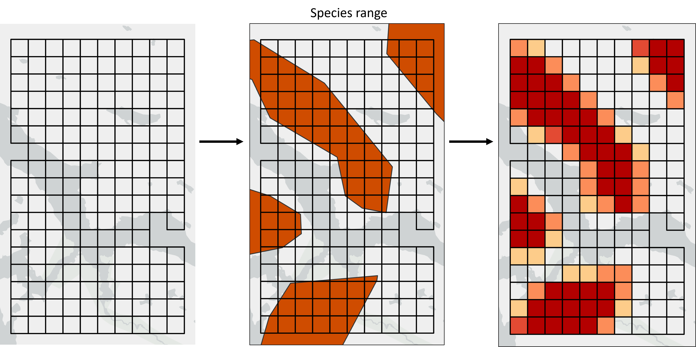
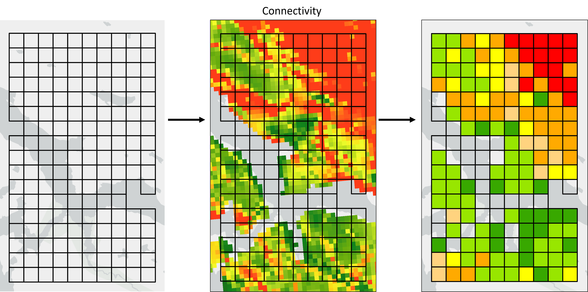

# Introduction

This article is intended for users already familiar with the basic functionality of *Where to Work*. It is recommended to first read the [official manual](https://ncc-cnc.github.io/wheretowork/articles/wtw_manual.html) before proceeding.

Input data for *Where to Work* needs to be summarized by planning unit during the data-prep stage. We strongly recommend using the 4-file input format described in [*Where To Work* data preparation repository](https://github.com/NCC-CNC/wtw-data-prep).

As described in the Goals section of the [wtw-theory](https://ncc-cnc.github.io/wheretowork/articles/wtw_theory.html#goals) article, *Where to Work* operates on the values assigned to each planning unit. Planning unit values for Themes, Weights, Includes and Excludes therefore need to be carefully prepared before feeding the planning units into *Where to Work*. The correct way to summarize the input data depends on the planning unit type (i.e. equal area vs different areas), the units of the input data (i.e. area/distance/count, other units, unitless), and the type of layer being summarized (i.e. Theme, Weight or Include/Exclude). Planning unit values can generally be of two types: binary, where all the values are either zero or one; or continuous, where any value is possible. Generally we recommend that all Includes and Excludes use binary values, and all Themes and Weights use continuous values. This is explained further below.

# Themes

The important thing to remember for Themes is that each Theme will be assigned a Goal, and *Where to Work* will attempt to meet the Goal by summing the Themes values across all planning units in a solution. As such, values need to be numeric and have meaningful units (e.g., km, km^2^, tonnes of carbon). Additionally, we would ideally retain as much detail from the source data as possible when we summarize the data for the planning units.

#### Area/distance/count data

Most Themes will be layers representing area, distance or count data. Examples are species ranges (area), lengths of rivers (distance), and points representing important sites (count). We recommend simply summing the area/distance/count of these data in each planning unit.

```{r echo = FALSE, fig.cap = "*Fig 1. Species ranges representing areas of presence/absence are converted into planning unit values representing the area of each planning unit covered by the species range.*"}

```

In the case of species range data, we could set a threshold (e.g. 50%) and assign each planning unit to presence/absence based on the overlap with the planning unit and the threshold (i.e. every planning unit would have a value of either zero, or the full planning unit area). This approach creates clean maps that look nicer in the *Where to Work* display. However, summing the area retains more information, especially in cases where some range polygons are smaller than the planning units.

#### Categorical data

Categorical data need pre-processing for the *Where to Work* tool. These data includes rasters or vector data that contain integer values that correspond to different classes. For example, land cover data are often expressed as categorical data, where each land cover class (e.g., forest, shrubland, grassland) is stored as a different integer value. To use such data with the *Where to Work* tool, we recommend extracting each categorical class as a separate Theme that contains binary values (i.e., zeros and ones) indicating if the class is present within each planning unit. This process is also known as [one hot coding](https://www.geeksforgeeks.org/ml-one-hot-encoding/). For example, you might have a categorical land cover dataset that contains forest, shrubland, and grassland classes. In this dataset, a value of 1 might denote forest areas, a value of 2 might denote shrubland areas, and a value of 3 might denote grassland areas. To prepare such data, we recommend converting this dataset into a three separate Themes (one Theme for each class) that each contain binary values (i.e., zeros and one) indicating where a given land cover class is present. Thus the first Theme would contain binary values indicating the presence or absence of forest areas, the second Theme would contain binary values indicating the presence or absence of shrubland areas, and the third Theme would contain binary values indicating the presence or absence of grassland areas.

### Probability data

Probability data benefits from pre-processing to ensure that the *Where to WOrk* tool provides meaningful solutions. For example, probability data may include predictions by species distribution models. Although it is possible to use such probability data with the *Where to Work* tool, this can produce undesirable results. In particular, when using such data as Themes, it is possible to generate solutions that meet the Goal for the Theme by selecting lots of planning units with low probability values. This can be undesirable because you may wish to, instead, obtain a solution that selects fewer planning units with higher probability values. In such cases, we recommend selecting a threshold to convert the probability values into binary values and using the binary data as a Theme for the *Where to Work* tool. Thus the only way for a solution to meet the Goal would be to select planning units that have a probability value above the selected threshold. If you wish to retain some continuous information, another strategy is to clamp the probability values such that (i) values below a selected threshold are set to zero and (ii) values above the threshold remain the same. As such, a solution cannot meet the Goal by selecting planning units with low probability values, and information on the relative occurrence can be used to inform the optimization process.

#### Other data

Other data types will need to be considered on a case by case basis. For example, a dataset describing carbon sequestration might describe the amount of carbon (in tonnes) that could be potentially be sequestered per pixel. In this case, the total amount of carbon per planning unit could be calculated by summing together the pixel values that occur within the planning unit. Remember that *Where to Work* will run using any input layer values, so the responsibility is on the user to make sure the values provided are suitable.

```{r echo = FALSE, fig.cap = "*Fig 2. A raster layer representing tonnes of Carbon can be summed into the planning units and can retain the same units.*"}
knitr::include_graphics("figures/carbon.png")
```

# Weights

Ideally, data-prep for Weights should follow the same guidelines as Themes, however since Weights do not have Goals attached to them there is some additional flexibility. Unitless Weights can be used for example, as long as the values are numeric.

If planning units are all the same size, it may be appropriate to calculate the mean Weight value per planning unit. However, where possible we still recommend summing values, especially if planning units are of different sizes. This is because *Where to Work* does not account for planning unit area when processing Weights. If a larger planning unit should have a relatively higher Weight than a smaller one, this should be accounted for during data prep (e.g. by summing rather than averaging).

```{r echo = FALSE, fig.cap = "*Fig 3. Connectivity is a unitless Weight. Here we calculate the average connectivity value per planning unit, but if planning units were of different sizes we might consider summing.*"}

```

# Includes/Excludes

The guidelines for Includes and Excludes are different because every planning unit needs to be either locked-in or locked-out of the solution. Values should therefore be binary where each planning unit has a value of zero or one. This means that for source data representing areas, users will need to decide thresholds to determine if planning units are assigned as zero or one depending on the overlap of the planning unit with the source layer. Using a 50% threshold for areas is generally recommended because it should average out to cover approximately the same area as the input data. In some cases users might want to use a different approach. For example an Include could be set to one if any of the planning unit intersects with the source layer.

```{r echo = FALSE, fig.cap = "*Fig 4. For includes of existing protected areas, we use an area threshold of 50% so any planning unit with >= 50% coverage is assigned a value of 1, otherwise it's assigned a value of 0.*"}
knitr::include_graphics("figures/includes.png")
```

# Data preparation

More information on data prep as well as scripts for preparing input data of various formats can be found in the [*Where To Work* data preparation repository](https://github.com/NCC-CNC/wtw-data-prep).
